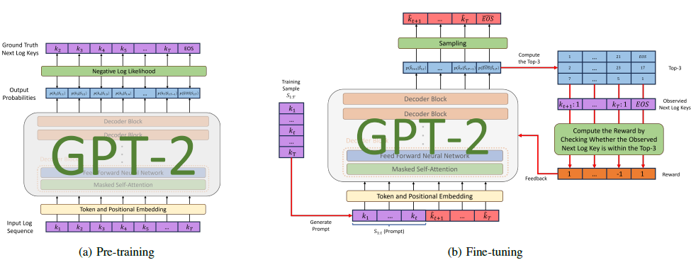

# LogGPT: Log Anomaly Detection via GPT
This repository contains a Pytorch implementation of [LogGPT](https://arxiv.org/abs/2309.14482), a novel model that employs GPT for log anomaly detection. `LogGPT` is first trained to predict the next log entry based on the preceding sequence ((a) Pre-training). To further enhance the performance of `LogGPT`, a novel reinforcement learning (RL) strategy is proposed to finetune the model specifically for the log anomaly detection task ((b) Fine-tuning).



## Configuration
- Ubuntu 20.04
- NVIDIA driver 495.29.05 
- CUDA 11.3
- Python 3.9.7
- PyTorch 1.11.0

## Installation
This code requires the packages listed in requirements.txt.
A virtual environment is recommended to run this code

On macOS and Linux:  
```
python3 -m pip install --user virtualenv
python3 -m venv env
source env/bin/activate
pip install -r requirements.txt
deactivate
```
Reference: https://packaging.python.org/guides/installing-using-pip-and-virtual-environments/

## Instructions
Run and test:

    python3 main.py HDFS
    or
    python3 main.py BGL
    or
    python3 main.py Thunderbird


## Reference

If you plan to use `LogGPT` in your project, please consider citing [our paper](https://arxiv.org/abs/2309.14482):
```bash
@misc{han2023loggpt,
      title={LogGPT: Log Anomaly Detection via GPT}, 
      author={Xiao Han and Shuhan Yuan and Mohamed Trabelsi},
      year={2023},
      eprint={2309.14482},
      archivePrefix={arXiv},
      primaryClass={cs.LG}
}
```

## Contact
If you have any questions, please contact Mohamed Trabelsi (mohamed.trabelsi@nokia-bell-labs.com) and Xiao Han (hanxiao2099@gmail.com).

## Acknowledgements
The code is mainly written by Xiao Han during his internship at Nokia Bell Labs.

## License
LogGPT is CC-BY-NC-4.0 licensed as of now.
